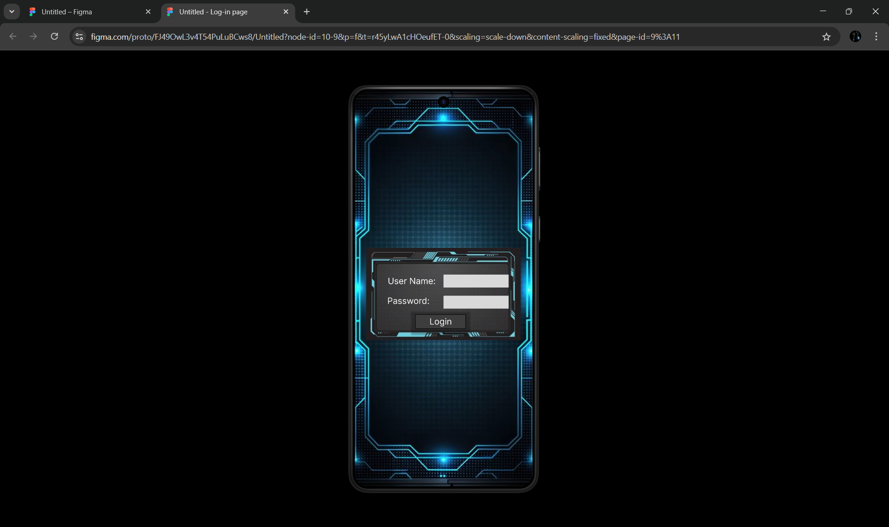
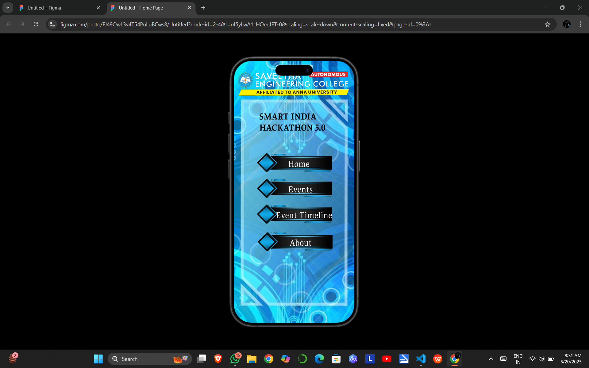
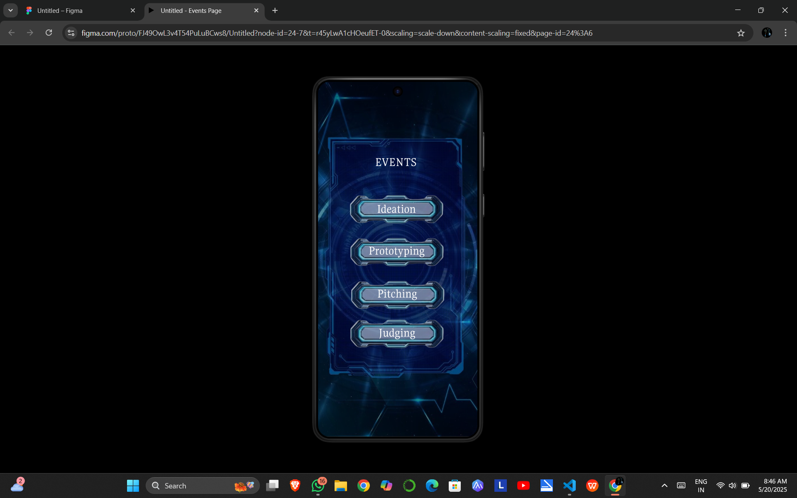
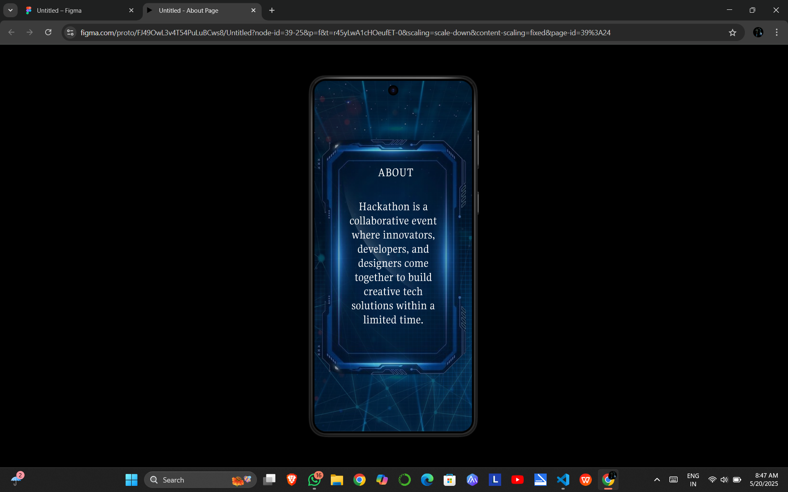

# Ex09 Event Registration Web Application
## Date:20-05-2025

## AIM:
To design, develop and deploy a web application for event registration.

## DESIGN STEPS:

### Step 1:
Create a new frame.

### Step 2:
Select any one preset size of your choice.

### Step 3:
Select the shapes you need.

### Step 4:
Import images as needed.

### Step 5:
Create pages based on your need and link them.

### Step 6:

Validate the HTML and CSS code.

### Step 6:

Publish the website in the given URL.

## DESIGN TOOL:
Figma

## CODE:

### Log-in page 
#### index.html
```
<!DOCTYPE html>
<html>
  <head>
    <meta name="viewport" content="width=device-width, initial-scale=1" />
    <meta charset="utf-8" />
    <link rel="stylesheet" href="globals.css" />
    <link rel="stylesheet" href="style.css" />
  </head>
  <body>
    <div class="android-compact">
      <div class="overlap-group-wrapper">
        <div class="overlap-group">
          <div class="overlap">
            <div class="frame">
              
            </div>
            <div class="rectangle"></div>
            <div class="text-wrapper">Login</div>
          </div>
          
          <div class="div">
            <div class="div-wrapper"><div class="text-wrapper-2">User Name:</div></div>
            <div class="rectangle-2"></div>
          </div>
          <div class="rectangle-3"></div>
          <div class="text-wrapper-3">Password:</div>
        </div>
      </div>
    </div>
  </body>
</html>


```
#### global.css
```
@import url("https://cdnjs.cloudflare.com/ajax/libs/meyer-reset/2.0/reset.min.css");
* {
  -webkit-font-smoothing: antialiased;
  box-sizing: border-box;
}
html,
body {
  margin: 0px;
  height: 100%;
}
/* a blue color as a generic focus style */
button:focus-visible {
  outline: 2px solid #4a90e2 !important;
  outline: -webkit-focus-ring-color auto 5px !important;
}
a {
  text-decoration: none;
}

```
#### style.css
```
.android-compact {
  background-color: #ffffff;
  display: flex;
  flex-direction: row;
  justify-content: center;
  width: 100%;
}

.android-compact .overlap-group-wrapper {
  background-color: #ffffff;
  width: 412px;
  height: 917px;
}

.android-compact .overlap-group {
  position: relative;
  height: 917px;
  background-image: url(./img/360-f-1046262882-7ogjcdnciph4gxhgoa5ukhkqcf5eqyde-1.png);
  background-size: cover;
  background-position: 50% 50%;
}

.android-compact .overlap {
  position: absolute;
  width: 117px;
  height: 38px;
  top: 517px;
  left: 141px;
}

.android-compact .frame {
  width: 104px;
  height: 24px;
  top: 7px;
  position: absolute;
  left: 0;
}

.android-compact .hud-frames-blue-grey {
  position: absolute;
  width: 358px;
  height: 214px;
  top: -161px;
  left: -114px;
  object-fit: cover;
}

.android-compact .rectangle {
  position: absolute;
  width: 117px;
  height: 34px;
  top: 0;
  left: 0;
  background-color: #3c3c3c;
  border: 1px solid;
  border-color: #000000;
  box-shadow: 0px 4px 4px 10px #00000040;
}

.android-compact .text-wrapper {
  position: absolute;
  width: 117px;
  top: 4px;
  left: 0;
  font-family: "Inter-Regular", Helvetica;
  font-weight: 400;
  color: #ffffff;
  font-size: 20px;
  text-align: center;
  letter-spacing: 0;
  line-height: normal;
}

.android-compact .text-on-a-path {
  position: absolute;
  width: 142px;
  height: 37px;
  top: 361px;
  left: 186px;
}

.android-compact .div {
  position: absolute;
  width: 280px;
  height: 47px;
  top: 416px;
  left: 77px;
}

.android-compact .div-wrapper {
  width: 146px;
  height: 47px;
  top: 0;
  overflow: hidden;
  position: absolute;
  left: 0;
}

.android-compact .text-wrapper-2 {
  position: absolute;
  width: 232px;
  top: 11px;
  left: 0;
  font-family: "Inter-Regular", Helvetica;
  font-weight: 400;
  color: #ffffff;
  font-size: 20px;
  letter-spacing: 0;
  line-height: normal;
}

.android-compact .rectangle-2 {
  position: absolute;
  width: 151px;
  height: 30px;
  top: 9px;
  left: 129px;
  background-color: #d9d9d9;
}

.android-compact .rectangle-3 {
  position: absolute;
  width: 151px;
  height: 30px;
  top: 474px;
  left: 206px;
  background-color: #d9d9d9;
}

.android-compact .text-wrapper-3 {
  position: absolute;
  width: 111px;
  top: 473px;
  left: 76px;
  font-family: "Inter-Regular", Helvetica;
  font-weight: 400;
  color: #ffffff;
  font-size: 20px;
  letter-spacing: 0;
  line-height: normal;
}

```
### Home page 
#### index.html
```
<!DOCTYPE html>
<html>
  <head>
    <meta name="viewport" content="width=device-width, initial-scale=1" />
    <meta charset="utf-8" />
    <link rel="stylesheet" href="globals.css" />
    <link rel="stylesheet" href="style.css" />
  </head>
  <body>
    <div class="android-compact">
      <div class="overlap-group-wrapper">
        <div class="overlap-group">
          
          
          <div class="text-wrapper">SMART INDIA HACKATHON 5.0</div>
          
          
          
          <div class="div">Events</div>
          
          <div class="text-wrapper-2">Home</div>
          <div class="text-wrapper-3">Event Timeline</div>
          <div class="text-wrapper-4">About</div>
        </div>
      </div>
    </div>
  </body>
</html>


```
#### global.css
```
@import url("https://cdnjs.cloudflare.com/ajax/libs/meyer-reset/2.0/reset.min.css");
* {
  -webkit-font-smoothing: antialiased;
  box-sizing: border-box;
}
html,
body {
  margin: 0px;
  height: 100%;
}
/* a blue color as a generic focus style */
button:focus-visible {
  outline: 2px solid #4a90e2 !important;
  outline: -webkit-focus-ring-color auto 5px !important;
}
a {
  text-decoration: none;
}


```
#### style.css
```
.android-compact {
  background-color: #ffffff;
  display: flex;
  flex-direction: row;
  justify-content: center;
  width: 100%;
}

.android-compact .overlap-group-wrapper {
  background-color: #ffffff;
  width: 402px;
  height: 874px;
}

.android-compact .overlap-group {
  position: relative;
  height: 874px;
  background-image: url(./img/soft-blue-background-1.png);
  background-size: cover;
  background-position: 50% 50%;
}

.android-compact .abstract-blue-techno {
  position: absolute;
  width: 402px;
  height: 874px;
  top: 0;
  left: 0;
  object-fit: cover;
}

.android-compact .SEC-LOGO {
  position: absolute;
  width: 402px;
  height: 92px;
  top: 30px;
  left: 0;
  object-fit: cover;
}

.android-compact .text-wrapper {
  position: absolute;
  width: 235px;
  top: 166px;
  left: 85px;
  font-family: "Gupter-Bold", Helvetica;
  font-weight: 700;
  color: #000000;
  font-size: 32px;
  letter-spacing: 0;
  line-height: normal;
}

.android-compact .img {
  position: absolute;
  width: 272px;
  height: 272px;
  top: 208px;
  left: 65px;
  object-fit: cover;
}

.android-compact .img-2 {
  top: 293px;
  left: 65px;
  position: absolute;
  width: 272px;
  height: 272px;
  object-fit: cover;
}

.android-compact .img-3 {
  top: 379px;
  left: 65px;
  position: absolute;
  width: 272px;
  height: 272px;
  object-fit: cover;
}

.android-compact .div {
  position: absolute;
  top: 409px;
  left: 181px;
  font-family: "Gupter-Regular", Helvetica;
  font-weight: 400;
  color: #ffffff;
  font-size: 32px;
  letter-spacing: 0;
  line-height: normal;
  white-space: nowrap;
}

.android-compact .img-4 {
  top: 471px;
  left: 67px;
  position: absolute;
  width: 272px;
  height: 272px;
  object-fit: cover;
}

.android-compact .text-wrapper-2 {
  position: absolute;
  top: 324px;
  left: 181px;
  font-family: "Gupter-Regular", Helvetica;
  font-weight: 400;
  color: #ffffff;
  font-size: 32px;
  letter-spacing: 0;
  line-height: normal;
  white-space: nowrap;
}

.android-compact .text-wrapper-3 {
  position: absolute;
  top: 495px;
  left: 140px;
  font-family: "Gupter-Regular", Helvetica;
  font-weight: 400;
  color: #ffffff;
  font-size: 32px;
  letter-spacing: 0;
  line-height: normal;
  white-space: nowrap;
}

.android-compact .text-wrapper-4 {
  position: absolute;
  top: 587px;
  left: 186px;
  font-family: "Gupter-Regular", Helvetica;
  font-weight: 400;
  color: #ffffff;
  font-size: 32px;
  letter-spacing: 0;
  line-height: normal;
  white-space: nowrap;
}


```

### Events page 
#### index.html
```
<!DOCTYPE html>
<html>
  <head>
    <meta name="viewport" content="width=device-width, initial-scale=1" />
    <meta charset="utf-8" />
    <link rel="stylesheet" href="globals.css" />
    <link rel="stylesheet" href="style.css" />
  </head>
  <body>
    <div class="android-compact">
      <div class="overlap-group-wrapper">
        <div class="overlap-group">
          
          
          <div class="text-wrapper">EVENTS</div>
          
          
          
          <div class="div">Prototyping</div>
          <div class="text-wrapper-2">Pitching</div>
          <div class="text-wrapper-3">Judging</div>
        </div>
      </div>
    </div>
  </body>
</html>


```
#### global.css
```
@import url("https://cdnjs.cloudflare.com/ajax/libs/meyer-reset/2.0/reset.min.css");
* {
  -webkit-font-smoothing: antialiased;
  box-sizing: border-box;
}
html,
body {
  margin: 0px;
  height: 100%;
}
/* a blue color as a generic focus style */
button:focus-visible {
  outline: 2px solid #4a90e2 !important;
  outline: -webkit-focus-ring-color auto 5px !important;
}
a {
  text-decoration: none;
}


```
#### style.css
```
.android-compact {
  background-color: #ffffff;
  display: flex;
  flex-direction: row;
  justify-content: center;
  width: 100%;
}

.android-compact .overlap-group-wrapper {
  background-color: #ffffff;
  width: 412px;
  height: 917px;
}

.android-compact .overlap-group {
  position: relative;
  height: 917px;
  background-image: url(./img/1a0edb819bdd4d71931797f817541746-1.png);
  background-size: cover;
  background-position: 50% 50%;
}

.android-compact .img {
  position: absolute;
  width: 412px;
  height: 917px;
  top: 0;
  left: 0;
  object-fit: cover;
}

.android-compact .img-2 {
  position: absolute;
  width: 412px;
  height: 794px;
  top: 56px;
  left: 0;
  object-fit: cover;
}

.android-compact .text-wrapper {
  position: absolute;
  width: 163px;
  top: 188px;
  left: 120px;
  font-family: "Gupter-Regular", Helvetica;
  font-weight: 400;
  color: #ffffff;
  font-size: 32px;
  text-align: center;
  letter-spacing: 0;
  line-height: normal;
}

.android-compact .dff-a-c {
  position: absolute;
  width: 337px;
  height: 247px;
  top: 590px;
  left: 75px;
  object-fit: cover;
}

.android-compact .dff-a-c-2 {
  width: 335px;
  top: 490px;
  left: 77px;
  position: absolute;
  height: 247px;
  object-fit: cover;
}

.android-compact .dff-a-c-3 {
  width: 337px;
  top: 379px;
  left: 75px;
  position: absolute;
  height: 247px;
  object-fit: cover;
}

.android-compact .div {
  position: absolute;
  width: 159px;
  top: 417px;
  left: 124px;
  font-family: "Gupter-Regular", Helvetica;
  font-weight: 400;
  color: #ffffff;
  font-size: 32px;
  text-align: center;
  letter-spacing: 0;
  line-height: normal;
  white-space: nowrap;
}

.android-compact .text-wrapper-2 {
  position: absolute;
  width: 156px;
  top: 528px;
  left: 127px;
  font-family: "Gupter-Regular", Helvetica;
  font-weight: 400;
  color: #ffffff;
  font-size: 32px;
  text-align: center;
  letter-spacing: 0;
  line-height: normal;
  white-space: nowrap;
}

.android-compact .text-wrapper-3 {
  position: absolute;
  width: 157px;
  top: 629px;
  left: 126px;
  font-family: "Gupter-Regular", Helvetica;
  font-weight: 400;
  color: #ffffff;
  font-size: 32px;
  text-align: center;
  letter-spacing: 0;
  line-height: normal;
  white-space: nowrap;
}


```

### About page 
#### index.html
```
<!DOCTYPE html>
<html>
  <head>
    <meta name="viewport" content="width=device-width, initial-scale=1" />
    <meta charset="utf-8" />
    <link rel="stylesheet" href="globals.css" />
    <link rel="stylesheet" href="style.css" />
  </head>
  <body>
    <div class="android-compact">
      <div class="overlap-group-wrapper">
        <div class="overlap-group">
          
          
          
          <div class="text-wrapper">ABOUT</div>
          <p class="div">
            Hackathon is a collaborative event where innovators, developers, and designers come together to build
            creative tech solutions within a limited time.
          </p>
        </div>
      </div>
    </div>
  </body>
</html>

```
#### global.css
```
@import url("https://cdnjs.cloudflare.com/ajax/libs/meyer-reset/2.0/reset.min.css");
* {
  -webkit-font-smoothing: antialiased;
  box-sizing: border-box;
}
html,
body {
  margin: 0px;
  height: 100%;
}
/* a blue color as a generic focus style */
button:focus-visible {
  outline: 2px solid #4a90e2 !important;
  outline: -webkit-focus-ring-color auto 5px !important;
}
a {
  text-decoration: none;
}

```
#### style.css
```
.android-compact {
  background-color: #ffffff;
  display: flex;
  flex-direction: row;
  justify-content: center;
  width: 100%;
}

.android-compact .overlap-group-wrapper {
  background-color: #ffffff;
  width: 412px;
  height: 917px;
}

.android-compact .overlap-group {
  position: relative;
  height: 917px;
  background-image: url(./img/e03badc3aaa918c98dcb5c70cec24521-1.png);
  background-size: cover;
  background-position: 50% 50%;
}

.android-compact .img {
  position: absolute;
  width: 412px;
  height: 917px;
  top: 0;
  left: 0;
  object-fit: cover;
}

.android-compact .img-2 {
  position: absolute;
  width: 412px;
  height: 787px;
  top: 68px;
  left: 0;
  object-fit: cover;
}

.android-compact .text-wrapper {
  position: absolute;
  width: 134px;
  top: 220px;
  left: 146px;
  font-family: "Gupter-Regular", Helvetica;
  font-weight: 400;
  color: #ffffff;
  font-size: 32px;
  text-align: center;
  letter-spacing: 0;
  line-height: normal;
  white-space: nowrap;
}

.android-compact .div {
  position: absolute;
  width: 241px;
  top: 309px;
  left: 86px;
  font-family: "Gupter-Regular", Helvetica;
  font-weight: 400;
  color: #ffffff;
  font-size: 32px;
  text-align: center;
  letter-spacing: 0;
  line-height: normal;
}

```


## OUTPUT:
### Log-in page 

### Home page 

### Events page 

### About page 


## RESULT:
The program to design, develop and deploy a web application for event registration is completed successfully.
